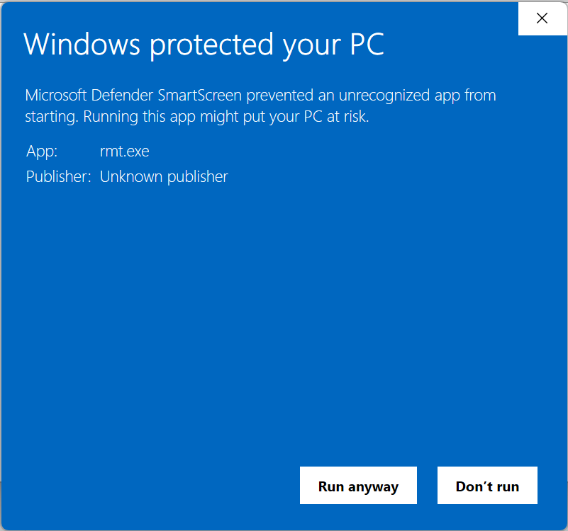

# RMT Testing

I took over the RMT project to provide musicians with a Atari 8-bit tracker that works well and correctly on modern platforms, creates reproducible output that can be replayed correctly in all environments and that can be preserved losslessly as an ".SAP" file in the [Atari Sound Music Archive (ASMA)](https://asma.atari.org/).

And while I am well versed in programming, I have absolutely not clue about composing music or using a tracker correctly. There I need the support from the people who actually use the tracker to find what is not correct and needs to be fixed or improved. This applies particularly to the Java port which shall replace the clumsy C++/Windows-only version in future.

## Download

You can download the latest Java build from [Github](https://github.com/peterdell/RASTER-Music-Tracker/releases). Because the binaries are not signed, you may have to confirm explicitly that you want to run the program.

- On Windows  

## Feedback

I want to keep the feedback and discussion focused. Therefore I decided to not have public discussion thread for this, be have direct communication with each tester. The final results of the discussions will of course be published.

You can contact me via [PM on AtariAge](https://forums.atariage.com/profile/17404-jac) or [e-mail](mailto::jac@wudsn.com).

