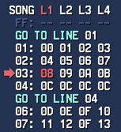

## GO TO LINE and Subsongs

// TODO This needs to be reworked

Using the "GO TO LINE" command, you can create multiple sub-songs in a module.
To be more specific, if the Subsong itself is constructed using multiple Goto commands, the last Goto command will be used for identifying where the Loop point is set.

This is used mainly defined at the Export time, since it requires some analysis to "Find" precisely where all Subsongs are located to.

By default, any line below a Goto command will be assumed to be the start of a Subsong, since that's the most straightforward way to "Seek" through them.

A nice little trick I like to use is to set the song line "00" with a Goto command to force it to "Play" that Subsong first, everything else will follow the same order as usual.

Let's say I edited the Goto command on song line "00" to be set to "06" instead of "01", it will index the subsong 2 to be played first, and the subsong 1 will be indexed to play second.

The Subsong Index will assume the Subsong starting on song line 01 to be the "Next" Subsong as far as the logic goes, if that makes sense.

It's probably more of an exploit than anything, but still, everything works as intended so might as well make use of it when it is useful.